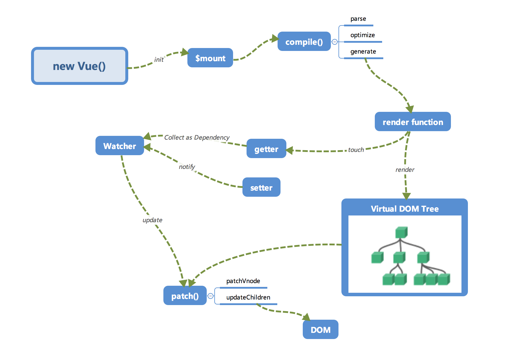

## 主要内容

* Vue.js内部运行机制，各个API背后原理
* 精准定位基于Vue.js构建的项目中的各种问题原因
* 深入了解Vue.js的`响应式`机制
* Vue.js如何进行`依赖收集`，准确地追踪所需修改
* 理解`template`模板的编译机制
* 明白`Virtual DOM`是什么，了解如何基于它实现比对应用及跨平台
* 深入理解Vue.js的`批量异步更新`策略
* `Vuex`的工作原理

[《Vue.js源码解析》](https://github.com/answershuto/learnVue)

