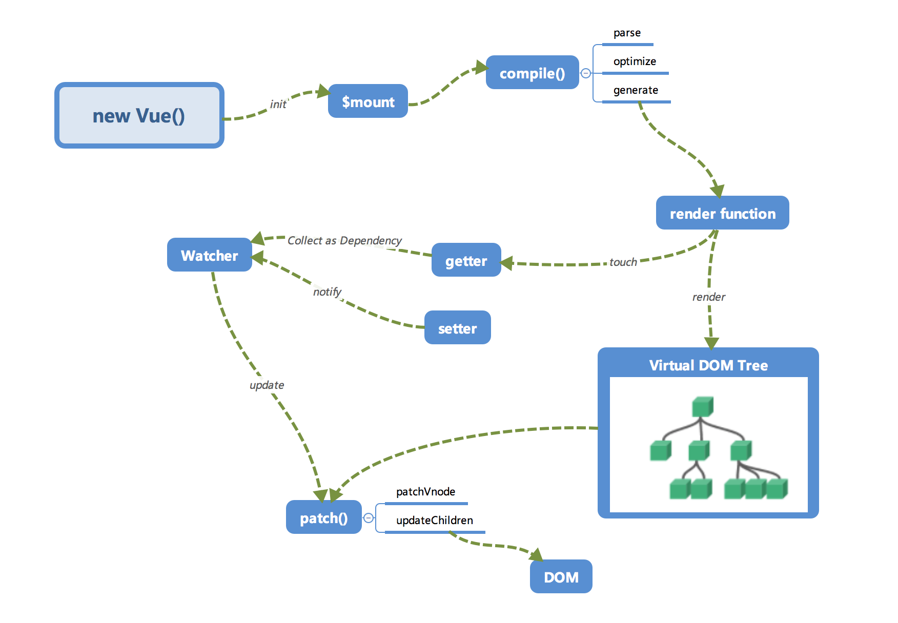
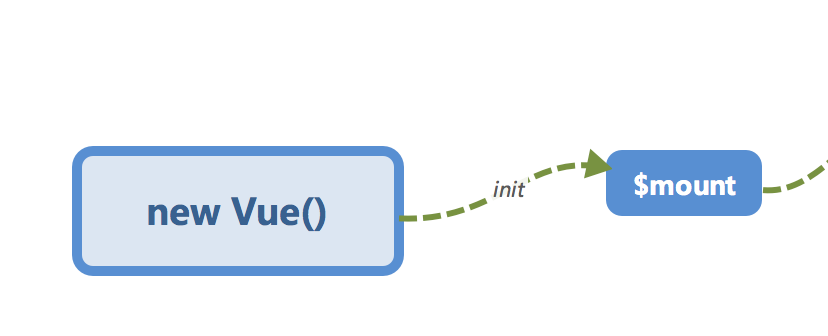
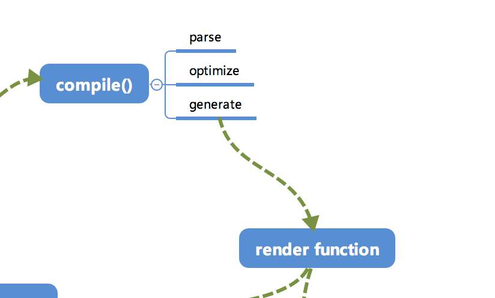
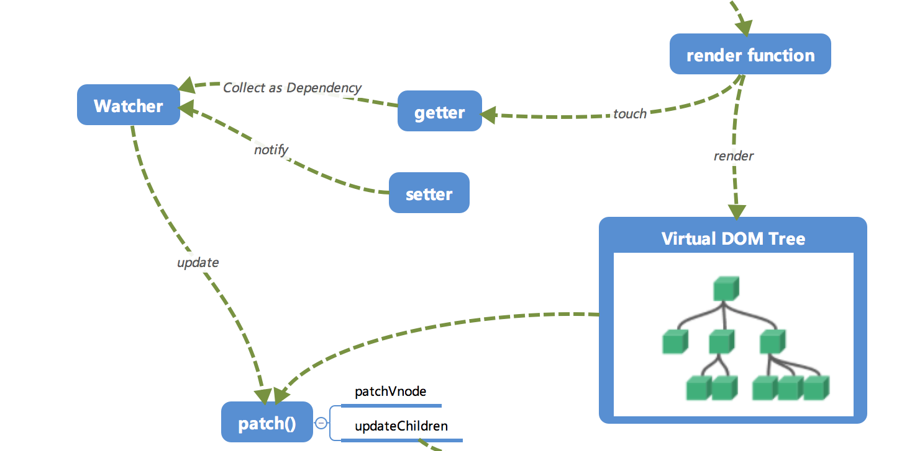
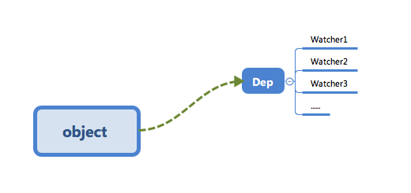
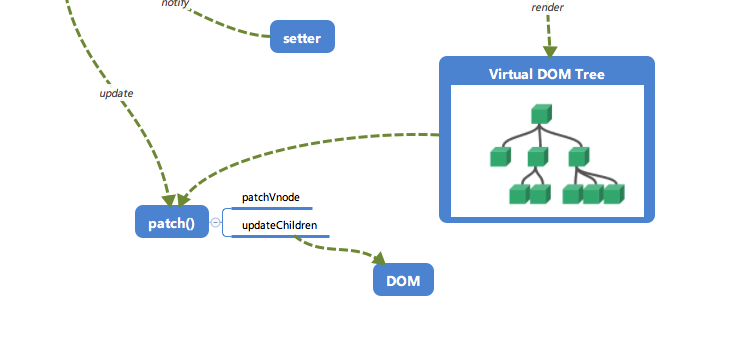

## Vue.js运行机制全局概览

### 全局概览

介绍Vue.js内部的整个流程：对全局有一个整体的印象，再对逐个模块进行讲解。

内部流程图：




### 初始化及挂载



在`new Vue()`之后，Vue会调用`_init`函数进行初始化（即这里的`init`过程）【初始化生命周期、事件、props、methods、data、computed与watch等】。其中**最重要的**是通过`Object.defineProperty`设置`setter`与`getter`函数，用来实现「**响应式**」以及「**依赖收集**」。

初始化之后调用`$mount`会挂载组件，如果是运行时编译¹（即不存在render function但是存在template的情况），需要进行「**编译**」步骤。

¹非运行时编译怎么用？？（不建议，编译过程会做一些优化）、用户可以自己传一个render函数

²`src/core/instance/index.js`

initMixin: 在Vue.prototype上挂载_init函数

stateMixin: 在Vue.prototype上挂载\$data, \$props, \$set, \$delete, $watch

eventsMixin: 与绑定事件相关的一些api，在Vue.prototype上挂载\$on, \$once, \$off, \$emit

lifecycleMixin: 一些生命周期函数，在Vue.prototype上挂载_update, \$forceUpdate, \$destroy

renderMixin: 与渲染有关的函数，\$nextTick, _render(得到VNode)

_init: 初始化生命周期lifecycle、事件events、渲染render、调用钩子beforeCreate、initInjections、初始化状态state、initProvide、调用钩子created、调用$mount


### 编译

compile编辑可以分成`parse`、`optimize`与`generate`三个阶段，最终需要得到render function。



* parse

  `parse`会用正则等方式解析template模板中的指令、class、style等数据=》形成AST

* optimize

  `optimize`的主要作用是标记static静态节点，这是Vue在编译过程中的一处优化，后面当`update`更新界面时，会有一个`patch`的过程，diff算法会直接跳过静态节点，从而减少了比较的过程，优化了`patch`的性能。

* generate

  `generate`是将AST转化成render function字符串的过程，得到结果是render的字符串以及staticRenderFns字符串。

经历过`parse`、`optimize`与`generate`这三个阶段之后，组件中就会存在渲染VNode所需的render function了。

¹`src/compiler/index.js`


### 响应式

Vue.js响应式核心部分：



使用`Object.defineProperty`绑定之后，当被设置的对象被读取的时候，会执行`getter`函数，而当被赋值的时候，会执行`setter`函数。

当render function被渲染时，因为会读取所需对象的值，所以会触发`getter`函数进行「**依赖收集**」，「依赖收集」的目的是：将观察者Watcher对象存放到当前***闭包***中的订阅者Dep的subs中。形成如下所示关系：



在修改对象的值的时候，会触发对应的`setter`，`setter`通知之前「**依赖收集**」得到的Dep中的每一个Watcher¹，告诉它们自己的值改变了，需要重新渲染视图。=》这些Watcher就会开始调用`update`来更新视图（中间有一个`patch`的过程以及使用队列来异步更新的策略）。

¹通知每一个Watcher，是指对应的dep保存的所有watcher。进行数据劫持的时候，循环遍历data中所有的属性（用Object.defineProperty包装），一个属性就会创建一个唯一的dep，当初始化解析编译界面的时候，一个指令/表达式就是一个watcher，那么解析指令/表达式的值的时候就去读data中的属性，触发getter，再触发添加dep添加订阅（将watcher添加到dep.subs中），当修改对应的属性的时候，触发setter，那么就再去触发这个dep保存的所有watcher（调用观察者的update方法）。

²Dep是订阅器，Watcher是订阅者（观察者），订阅器里可以放n个订阅者

³`src/core/observer/dep.js`

`src/core/observer/watcher.js`


### Virtual DOM

render function会被转化成VNode节点。

Virtual DOM就是一棵以JavaScript对象（VNode节点）作为基础的树，用对象属性来描述节点，实际上只是一层对真实DOM的抽象。=》最终可以通过一系列操作使这棵树映射到真实环境上。

由于Virtual DOM是以JavaScript对象为基础而不依赖真实平台环境，所以使它具有了跨平台的能力，比如说浏览器平台、Weex、Node等。

一个🌰：

```javascript
{
  tag: 'div',
  children: [
    {
      tag: 'a',
      text: 'click me'
    }
  ]
}
```

```html
<!-- 渲染后得到 -->
<div>
  <a>click me</a>
</div>
```

实际上的节点有更多的属性来标志节点，如isStatic（是否为静态节点）、isComment（是否为注释节点）等。


### 更新视图



修改一个对象值的时候，会通过`setter -> Watcher -> update`的流程来修改对应的视图

当数据变化后，执行render function就可以得到=》一个新的VNode节点，要想得到新的视图，**最简单粗暴的方法**就是：直接解析这个新的VNode节点，然后用`innerHTML`直接全部渲染到真实DOM中。=》但是只是修改一小块内容，就有些「**浪费**」=》不能只修改「改变了的地方」？=》「***patch***」：将新的VNode与旧的VNode一起传入`patch`进行比较，经过diff算法得出它们的「**差异**」=》只将这些「差异」的对应DOM进行修改即可。

¹render function touch（触发）依赖数据的getter，进而被该数据收集依赖；

render function 执行后生成VNode，VNode经过新旧对比生成patch，最终将patch应用到真实DOM上。