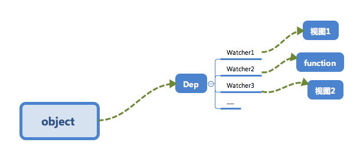

## 响应式系统的依赖收集追踪原理


### 为什么收集依赖？

🌰：（提高性能）

```javascript
new Vue( {
  template: 
  	`<div>
				<span>{{text1}}</span>
				<span>{{text2}}</span>
		</div>`,
  	data: {
      text1: 'text1',
      text2: 'text2',
      text3: 'text3',
    }
} );
// 执行如下操作
this.text3 = 'modify text3';
```

我们修改了`data`中的`text3`的数据，但是视图中并不需要用到`text3`，所以并不需要触发上一节的`cb`函数来更新视图，调用`cb`显然不正确。

再一个🌰：

```javascript
let globalObj = {
  text1: 'text1'
};

let o1 = new Vue( {
  template: 
  	`<div>
			<span>{{text1}}</span>
		</div>`,
  data: globalObj
} );

let o2 = new Vue( {
  template: 
  	`<div>
			<span>{{text1}}</span>
		</div>`,
  data: globalObj
} );
// 执行如下操作
globalObj.text1 = 'hello, text1';
```

此时应通知`o1`以及`o2`两个vm实例进行视图的更新。**依赖收集**让`text1`知道有两个地方依赖他的数据，变化时需要通知它们。



最终形成数据与视图的一种对应关系。


### 如何实现「依赖收集」

#### * 订阅者Dep

主要用于存放`Watcher`观察者对象（维护Watcher集合）

```javascript
class Dep {
  contructor () {
    // ...
  }
  
  addSub (sub) {
    // ...
  }
  
  notify () {
    // ...
  }
}
```

主要做两件事情：

1. `addSub`方法可以在当前`Dep`对象中增加一个`Watcher`对象的**订阅操作**；
2. 使用`notify`方法通知当前`Dep`对象的`subs`中的所有`Watcher`对象触发更新操作。

#### * 观察者Watcher

```javascript
class Watcher {
  constructor () {
    // ...
  }
  
  update () {
    // ...
  }
}
Dep.target = null;
```

#### * 依赖收集

修改一下`defineReactive`以及`Vue`的构造函数，来完成依赖收集。

* 在构造函数中 放一个Watcher实例。

1. 在`defineReactive`中增加一个Dep类的对象，用于收集`Watcher`对象。
2. 在对象的属性被**读**的时候，会触发`reactiveGetter`函数，把当前的`Watcher`对象（临时存放在Dep.targert中）收集到`Dep`对象中。
3. 之后当该属性被**写**的时候，会触发`reactiveSetter`函数，通知`Dep`对象调用`notify`来触发所有`Watcher`对象的`update`方法来更新对应视图。


### 小结

首先在`observe`的过程中会注册`get`方法，该方法用于「**依赖收集**」。

> 在get的闭包中放一个`Dep`对象，用于存放`Watcher`对象实例。
>
> 「依赖收集」的过程就是把`Watcher`实例存放到对应的`Dep`对象中去。

除此以外，依赖收集的前提条件还有两个：

1. 触发`get`方法
2. 新建一个`Watcher`对象

> 在例子中，在Vue的构造函数中新建了一个`Watcher`对象（用于组件渲染？），只需要new出来，此时`Dep.target`已经指向了这个new出来的`Watcher`对象。
>
> 而触发`get`也很简单，只要把render function进行渲染，那么其中的依赖都会被读取，此例中通过打印来模拟这个读取，来触发`get`进行**依赖收集**

`get`进行「依赖收集」，`set`通过观察者来更新视图


「补充」：

一个对象属性对应一个dep，一个dep对应多个watcher（一个对象属性可能在多个标签使用，就会有对应多个watcher，这些watcher都会放入到这个对象属性唯一对应的dep中）=> 这是**Vue1.0**的实现 => 当数据过大会导致watcher数量过多进而影响性能

**Vue2.0**中引入VDOM，给每个vue组件绑定一个watcher，这个组件上的数据的dep中都包含有该watcher => 新旧VDOM对比，极大减少watcher数量

每new一个watcher就触发一次该属性的getter操作（？）（与该watcher相关的属性）


对于例子，实例化了两次Vue，对globalObj执行了两遍observer，dep变了（？），第一次的dep收集的watcher没了（？）


Vuex：全局store -> 多个视图

组件：全局渲染Watcher-> 多个data属性

某一属性（对应唯一dep）->多个视图（的渲染Watcher）

