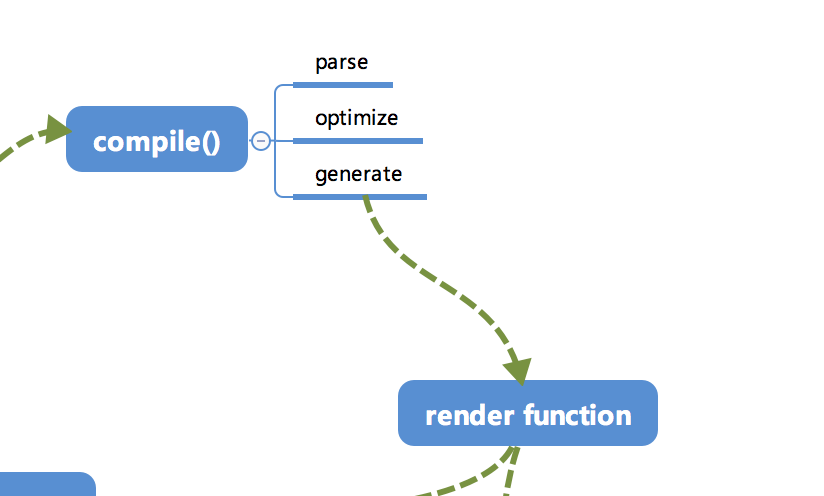

## template模板是怎样通过Compile编译的

### Compile

`compile`编译可以分成`parse`、`optimize`与`generate`三个阶段，最终得到*render function*。



🌰：

```html
<div :class="c" class="demo" v-if="isShow">
  <span v-for="item in sz">{{item}}</span>
</div>
```

```javascript
var html = '<div :class="c" class="demo" v-if="isShow"><span v-for="item in sz">{{item}}</span></div>';
```


#### 1. parse

`parse`会用正则等方式将template模板进行字符串解析，得到指令、class、style等数据，形成[AST](https://zh.wikipedia.org/wiki/%E6%8A%BD%E8%B1%A1%E8%AA%9E%E6%B3%95%E6%A8%B9)（此处特指编程语言的源代码??）。

🌰最终得到的AST大致是以下样子：

```json
{
    /* 标签属性的map，记录了标签上属性 */
    'attrsMap': {
        ':class': 'c',
        'class': 'demo',
        'v-if': 'isShow'
    },
    /* 解析得到的:class */
    'classBinding': 'c',
    /* 标签属性v-if */
    'if': 'isShow',
    /* v-if的条件 */
    'ifConditions': [
        {
            'exp': 'isShow'
        }
    ],
    /* 标签属性class */
    'staticClass': 'demo',
    /* 标签的tag */
    'tag': 'div',
    /* 子标签数组 */
    'children': [
        {
            'attrsMap': {
                'v-for': "item in sz"
            },
            /* for循环的参数 */
            'alias': "item",
            /* for循环的对象 */
            'for': 'sz',
            /* for循环是否已经被处理的标记位 */
            'forProcessed': true,
            'tag': 'span',
            'children': [
                {
                    /* 表达式，_s是一个转字符串的函数 */
                    'expression': '_s(item)',
                    'text': '{{item}}'
                }
            ]
        }
    ]
}
```

能够比较清晰地描述出标签的属性以及依赖关系。

**正则：**

用于匹配标签名、标签属性、标签起始、标签闭合、闭合标签、v-for条件、文本节点变量等。

**function advance (n)**

因为解析template采用*循环进行字符串匹配*的方式，所以每匹配解析完一段我们需要将已经匹配掉的去掉，头部的指针指向接下来需要匹配的部分。

**function parseHTML ()**

循环解析template字符串。使用`while`循环，用正则在匹配到标签头、标签尾以及文本的时候分别进行不同的处理，直到整个template被解析完毕。

**function parseStartTag ()**

使用`startTagOpen`正则得到标签的头部，可以得到`tagName`，同时我们需要一个数组`attrs`用来存放标签内的属性。

接下来使用`startTagClose`与`attribute`两个正则分别用来解析标签结束以及标签内的属性。使用`while`循环一直到匹配到`startTagClose`为止，解析内部所有的属性。

**stack:**

过程中，我们需要维护一个**stack**栈来保存已经解析好的标签头，这样可以在解析尾部标签的时候得到所属的层级关系以及父标签。同时定义一个**currentParent**变量用来存放当前标签的父标签节点的引用，`root`变量用来指向根标签节点。

将parseStartTag()返回的结果封装成**element**（即最终形成的AST的节点）

**function parseEndTag (tagName)**

用于解析尾标签。会从stack栈中取出最近的跟自己标签名一致的那个元素，将`currentParent`指向那个元素的前一个元素，并将该元素之前的元素都从stack中出栈。

**function parseText (text)**

解析文本有两种情况，一种是普通的文本，直接构建一个节点push进当前`currentParet`的`children`中即可；另一种是形如"{{item}}"这样的Vuejs表达式，需要用parseText来将表达式转化成代码。

使用一个`tokens`数组来存放解析结果，通过`defaultTagRE`来循环匹配text，如果是普通文本直接push到`tokens`数组中，如果是表达式，则转化成“_s(${exp})”的形式。

**function processIf (el) & function processFor (el)**

用于处理`v-if`以及`v-for`这样的Vuejs表达式

“v-for"会将指令解析成`for`属性以及`alias`属性，而”v-if“会将条件都存入`ifConditions`数组中。

```javascript
function parse () {
  parseHTML();
}
```


#### 2. optimize

主要作用：优化

涉及到`patch`过程，因为`patch`的过程实际上是将VNode节点进行一层一层的比对，然后将「差异」更新到视图上。那么一些静态节点是不会根据数据变化而产生变化的，这些节点我们没有比对的需求 => 跳过以节省一些性能。

标记`static`属性

**function isStatic (node)**

判断一个node是否是静态节点。如果type为2（表达式节点）则是非静态节点，type为3（文本节点）则是静态节点，如果存在`if`或者`for`这样的条件，也是非静态节点

**function markStatic (node)**

为所有的节点标记上`static`属性，同时会遍历当前节点的所有子节点，如果存在子节点是非静态节点，那么当前节点也是非静态节点。

**function markStaticRoots (node)**

用于标记`staticRoot`（静态根）

当前节点是静态节点，且存在子节点，并且只有一个子节点时这个子节点不是文本节点（作者认为此种情况的优化消耗大于收益），标记`staticRoot`为true，否则为false。

```javascript
function optimize (rootAst) {
  markStatic( rootAst );
  martStaticRoots( rootAst );
}
```


#### 3.generate

将AST转化成*render function*字符串，最终得到render的字符串以及staticRenderFns字符串。

得到的编译结果大体是以下样子：

```javascript
with(this){
    return (isShow) ? 
    _c(
        'div',
        {
            staticClass: "demo",
            class: c
        },
        _l(
            (sz),
            function(item){
                return _c('span',[_v(_s(item))])
            }
        )
    )
    : _e()
}
```

**function genIf (el)**

用于处理`if`条件

**function genFor (el)**

用于处理`for`循环

**function genText (el)**

用于处理文本节点

**function genElement (el)**

一个处理节点的函数。依赖`genChildren`以及`genNode`函数

根据当前节点是否有`if`或者`for`标记判断是否要用`genIf`或者`genFor`处理，否则通过`genChildren`处理子节点，同时得到`staticClass`、`class`等属性。

`genChildren`，遍历所有子节点，通过`genNode`处理后用”,"隔开拼接成字符串。

`genNode`，根据`type`来判断该节点使用文本节点`genText`还是标签节点`genElement`来处理。

```javascript
// 判断整个AST是否为空，为空则返回一个div标签，否则通过`genElement`来处理
function generate (rootAst) {
  const code = rootAst ? genElement( rootAst ) : '_c("div")';
  return {
    render: `with(this){return ${code}}`,
  }
}
```

得到的结果：

```javascript
{
  render: `with(this){return (isShow)?_c('div,'{staticClass: demo,class: c,},_l((sz),function(item){return _c('span,'{staticClass: undefined,class: undefined,},_v("hello, "+_s(item)+".")}): _e()`
}
```


