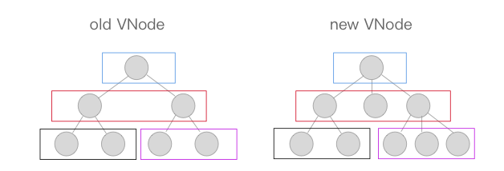

## 数据状态更新时的差异diff及patch机制

### 数据更新视图

对属性进行set时，`watcher`对象会触发`dep`，调用对应的`update`来修改视图。

最终是将新产生的Vnode节点与老Vnode节点进行一个`patch`的过程，比对得出「差异」，将这些「差异」更新到视图上。

### 跨平台

Virtual DOM终归只是一些JavaScript对象。调用不同平台的API，需要依赖一层适配层，将不同平台的API封装在内，以同样的接口对外提供。

```javascript
const nodeOps = {
  // ...
  // platform
};
```

### 重要的一些API

调用`nodeOps`中的相应函数来操作平台

```javascript
// 在 parent 这个父节点下插入一个子节点，如果指定了 ref 则插入到 ref 这个子节点前面。
function insert (parent, elm, ref) {
  // ...
}
// 新建一个节点， tag 存在创建一个标签节点，否则创建一个文本节点。
function createElm (vnode, parentElm, refElm) {
  // ...
}
// 批量调用 createElm 新建节点。
function addVnodes (parentElm, refElm, vnodes, startIdx, endIdx) {
  // ...
}
// 移除一个节点。
function removeNode (el) {
  // ...
}
// 批量调用 removeNode 移除节点。
function removeVnodes (parentElm, vnodes, startIdx, endIdx) {
  // ...
}
```

### patch

diff算法是通过同层的树节点进行比较而非对树进行逐层搜索遍历的方式，所有时间复杂度只有O(n)，是一种相当高效的算法。



上图中相同颜色的方块中的节点会进行比对，比对得到「差异」后将这些「差异」更新到视图上。

### sameVnode

比对是否是相同节点（key、tag、isComment、data etc.）

### patchVnode

在符合`sameVnode`的条件下触发，进行深层比对

* 是否全等
* 是否静态且key相同
* 新节点是否文本节点
* 以上都不是，进行子节点比对
  * 子节点都存在
  * 只有新的子节点存在
  * 只有旧的子节点存在
  * 新旧子节点都不存在->旧节点是否文本节点

### updateChildren

收尾逐渐向中间靠拢的比对过程


### 简单梳理

.png)


[一个简单例子](https://github.com/aaawhz/-vue2.0/blob/master/%E4%BB%8E%E4%B8%80%E4%B8%AA%E7%AE%80%E5%8D%95%E5%88%97%E5%AD%90%E5%88%97%E4%B8%BE%20diff%E7%AE%97%E6%B3%95%E6%B5%81%E7%A8%8B.pdf)

[一个稍复杂例子](https://github.com/aaawhz/-vue2.0/blob/master/diff%20%E5%A4%8D%E6%9D%82%E5%88%97%E5%AD%90.pdf)