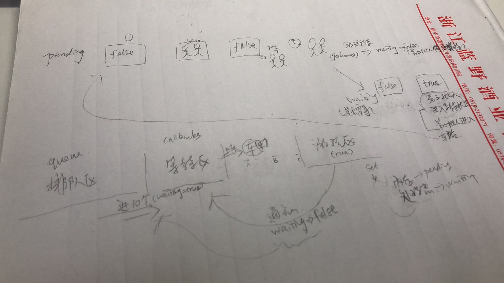

## 批量异步更新策略及nextTick原理

### 为什么要异步更新？

Vuejs是如何在我们修改`data`中的数据后修改视图的：

*setter -> Dep -> watcher -> (update) -> run -> patch ->更新视图*

假设频繁修改某数据`numer`1000次，**DOM会被更新1000次吗？**

Vuejs在默认情况下，每次触发某个数据的`setter`方法后，对应的`Watcher`对象其实会被`push`进一个队列`queue`中，在下一个tick的时候将这个队列`queue`全部拿出来`run`一遍。

### nextTick

Vuejs实现了一个`nextTick`函数，传入一个`cb`，这个`cb`会被存储到一个队列中，在下一个tick时触发队列中的所有`cb`事件。

Vuejs源码中分别用`Promise`、`setTimeout`、`setImmediate`等方式（兼容）在microtask（或是task）中创建一个事件，目的是在当前调用栈执行完毕以后（不一定立即）才会去执行这个事件。

[next-tick具体实现](https://github.com/vuejs/vue/blob/dev/src/core/util/next-tick.js#L90)

模拟实现：

1. 定义一个`callbacks`数据用来存储`cb`，在下一个tick处理这些回调函数之前，所有的`cb`都会被存在这个`callbacks`数组中
2. `pending`是一个标记位，代表一个等待的状态
3. `setTimeout`会在task中创建一个事件`flushCallbacks`
4. `flushCallbacks`会在执行时将`callbacks`中的所有`cb`依次执行

### 重写Watcher

因为频繁修改`number`对应的`Watcher`对象都是同一个，并**不**需要在下一个tick的时候执行**多个同样**的`Watcher`对象去修改界面，而只需要执行一个`Watcher`对象，使其将界面内容显示最新的数据即可。    ---->   过滤相同的`Watcher`（使用`id`标记）。

**修改**`update`方法，用于将`Watcher`放入`queue`中（queueWatcher），**增加**`run`方法用于实际触发`patch`更新视图。

### queueWatcher

queue中没有此Watcher对象，这个Watcher就会被push到`queue`中。

`waiting`是一个标记位，标记是否已经向`nextTick`传递了`flushSchedulerQueue`方法，在下一个tick的时候执行`flushSchedulerQueue`方法。

### flushSchedulerQueue

用于遍历队列`queue`，执行它里面所有`Watcher`对象的`run`方法。


### 例子(模拟触发两次watcher1的update)

```javascript
let watcher1 = new Watcher();
let watcher2 = new Watcher();

watcher1.update();
watcher1.update();
watcher2.update();
```


**数据变更**

```
=> setter
=> dep.notify
=> watcher.update
=> queueWatcher(this)
```

**queueWatcher**

[scheduler.js](https://github.com/vuejs/vue/blob/5255841aaf/src/core/observer/scheduler.js)

```
=>has[id]==null && queue.push(watcher)
=>!waiting && waiting=true && nextTick(()=> { // flushSchedulerQueue
  // 执行所有watcher的run方法
  waiting = false
})

第二批人从等待区出发（第一批人已通知游玩结束：waiting设为false停止等待），下一批人进入等待区（waiting设为true开始等待），第二批人入站
```

**nextTick**

```
=>callbacks.push(cb)
=>!pending && pending = true && setTimeout(()=> { // flushCallbacks
	pending = false
	// 执行所有cb（执行所有run，并重置waiting为false）
})


车站（callbacks）陆续进入一批人，如果有空车（pending为false），这批人上车（pending设为true），在下一个task时（setTimeout）车上的人已经清空、车回到车站（此时pending为false），已经下车的人去游玩（执行cb）
```




